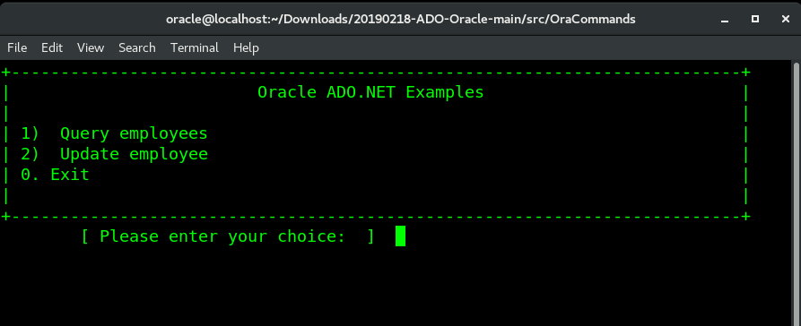
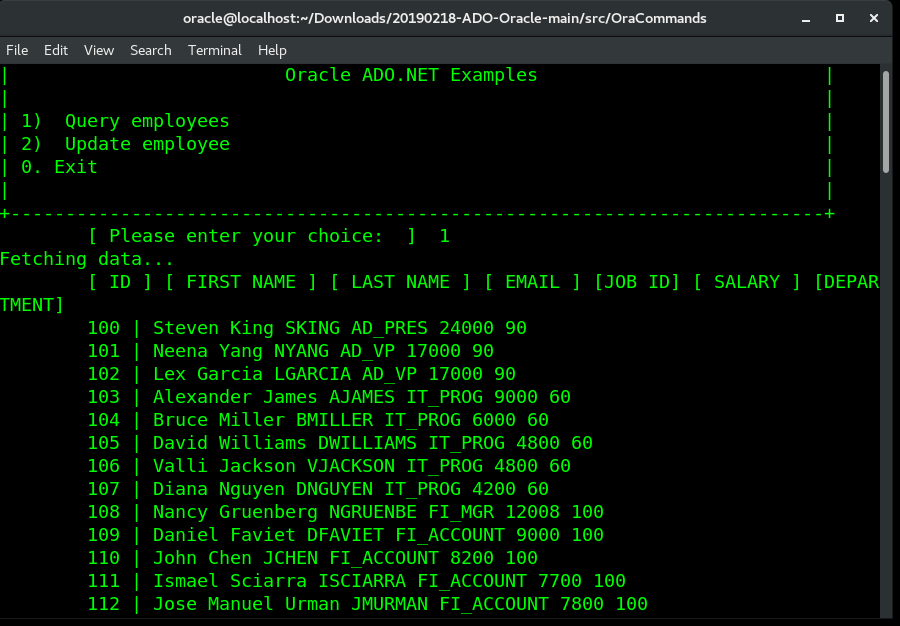
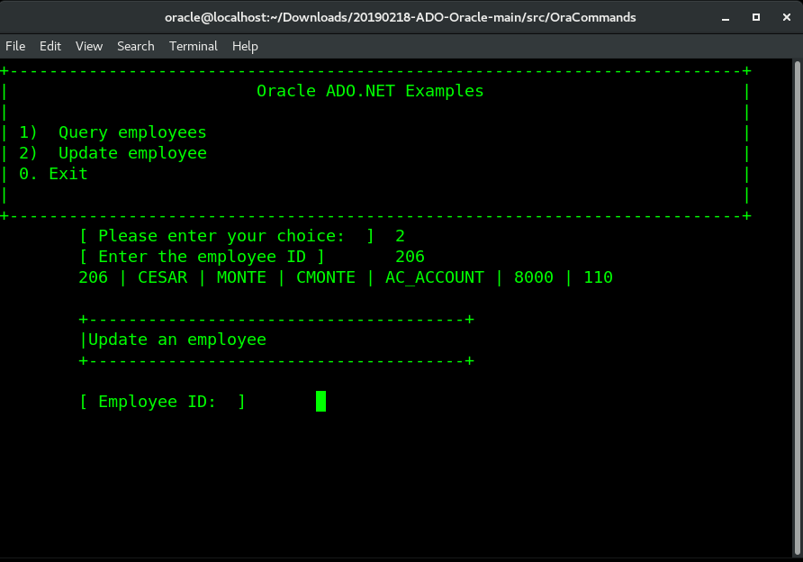
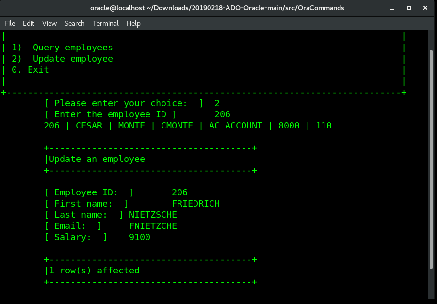

# How to execute Oracle parameterized commands with ODP.NET (Oracle)

SQL statements can receive input-only parameters, output-only parameters, and bidirectional parameters. You can use a OracleCommand object to execute parameterized SQL statements. To execute a parameterized SQL statement use the following steps:

<ol>
<li>Open a database connection,use OracleConnection.</li>
<li>Create and initialize an OracleCommand object.</li>
<li>Create a OracleParameter object, for each input parameter required by the SQL statement. Specify the name, type size, and value for each parameter, and add it to the parameters collection of the command object.</li>
<li>Execute the command by calling the ExecuteScalar, ExecuteReader, ExecuteXmlReader, or ExecuteNonQuery method, as appropriate for the type of SQL statement.</li>
<li>Use the return value obtained by executing the command.</li>
<li>Dispose the command object.</li>
<li>Close the database connection.</li>
</ol>

The following example shows how to execute a SQL statement that updates employee by searching for employee id.

<i>Fig 1. Example Main Menu</i>

Choosing the first option queries the database and fetch all records.

<i>Fig 2. Showing all records</i>

With the second option, we can search for one record then updates some properties.

Finally, the record is updated.

